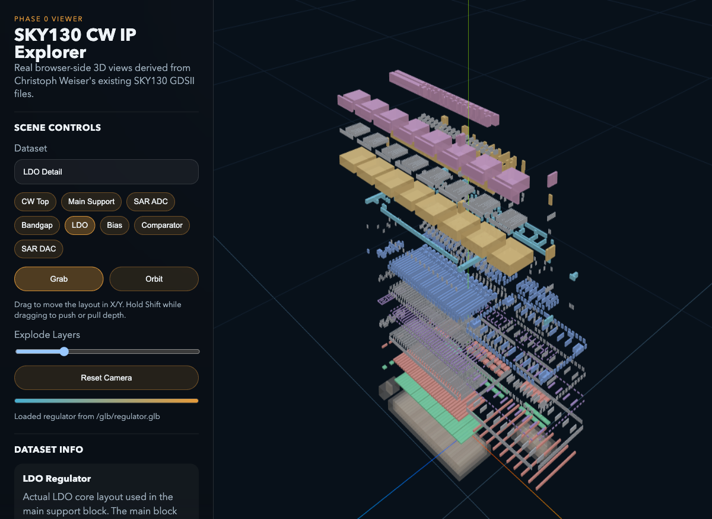

# GDSight

Immersive 3D layout inspection for GDSII-based IC designs, starting with real SKY130 analog IP in the browser and aiming toward Meta Quest / WebXR.



## Overview

GDSight turns existing GDSII layout data into navigable 3D scenes.

The current prototype uses real SKY130 layout data from Christoph Weiser's `sky130_cw_ip` project, exports selected cells into browser-friendly assets, and renders them with interaction patterns meant to carry forward into XR.

This is not a mock-layout demo. The browser viewer is already driven by existing GDSII files for:

- top-level and sub-block placement overviews
- bandgap reference
- LDO regulator
- bias block
- SAR comparator
- SAR DAC

## Current Capabilities

- Real `GDSII -> JSON` export for overview scenes
- Real `GDSII -> GLB` export for detailed cell views
- Browser-side 3D viewer with live loading progress
- Layer explosion control and per-layer visibility
- Grab-mode navigation inspired by Quest-style world manipulation
- Orbit mode with local pivot targeting and pointer-focused zoom
- SKY130 layer stack support for active geometry, poly, local interconnect, metals, and contact/via layers

## Project Layout

- [data/design.gds](data/design.gds): decompressed source GDS used for export
- [scripts/sky130_common.py](scripts/sky130_common.py): shared SKY130 layer stack and dataset definitions
- [scripts/export_sky130_demo.py](scripts/export_sky130_demo.py): exports overview/detail JSON datasets for the browser viewer
- [scripts/export_gds_glb.py](scripts/export_gds_glb.py): exports detailed GLB scenes from existing GDSII cells
- [viewer/index.html](viewer/index.html): no-build browser viewer entrypoint
- [viewer/app.js](viewer/app.js): scene loading, controls, UI state, and GLB integration
- [viewer/serve.py](viewer/serve.py): local dev server for the viewer and generated GLBs

## Quick Start

### 1. Create a virtual environment

```bash
python3 -m venv venv
./venv/bin/pip install gdstk numpy mapbox-earcut pygltflib
```

### 2. Run the browser viewer

```bash
python3 viewer/serve.py
```

Open [http://127.0.0.1:8080](http://127.0.0.1:8080).

If `8080` is busy:

```bash
python3 viewer/serve.py 8081
```

## Regenerating Assets

Export the browser JSON datasets:

```bash
./venv/bin/python scripts/export_sky130_demo.py
```

Export all configured detail GLBs:

```bash
./venv/bin/python scripts/export_gds_glb.py
```

Export one detailed cell:

```bash
./venv/bin/python scripts/export_gds_glb.py --slug regulator
```

Generated GLBs are written under `output/glb/`.

## Data Pipeline

```text
Existing SKY130 GDSII
  -> layer/process mapping
  -> selected cell extraction
  -> 3D extrusion
  -> JSON overviews + GLB detail assets
  -> browser viewer today
  -> Meta Quest / WebXR viewer next
```

## Viewer Notes

Overview scenes currently use exported JSON placement data.

Detailed scenes currently use exported GLB assets for:

- `bandgap`
- `regulator`
- `bias`
- `sar-comparator`
- `sar-dac`

The viewer includes:

- dataset switching between top-level and detailed blocks
- loading progress feedback for GLB scenes
- orbit and grab interaction modes
- dataset metadata, scene stats, and layer toggles

## Current Limits

- The implemented visualization stack is focused on the main SKY130 layers plus core contact/via layers
- Implant, marker, and non-visual process layers outside the current stack are still omitted
- Overview scenes are still JSON-backed rather than GLB-backed
- The first GLB pass emits non-indexed meshes, so file sizes are larger than they should be
- The XR path is still architectural intent; the current shipped viewer is browser-first

## Roadmap

- Replace overview JSON scenes with GLB exports
- Add drag-and-drop loading for arbitrary GLB assets
- Improve scene picking, clipping, and measurement tools
- Optimize mesh output and add compression
- Carry the same interaction model into WebXR / Meta Quest
- Expand beyond the current SKY130 demo cells into larger layouts

## Credits

- SKY130 reference layouts from Christoph Weiser's `sky130_cw_ip`
- Process inspiration and browser testbed work done in service of a future XR IC layout viewer
